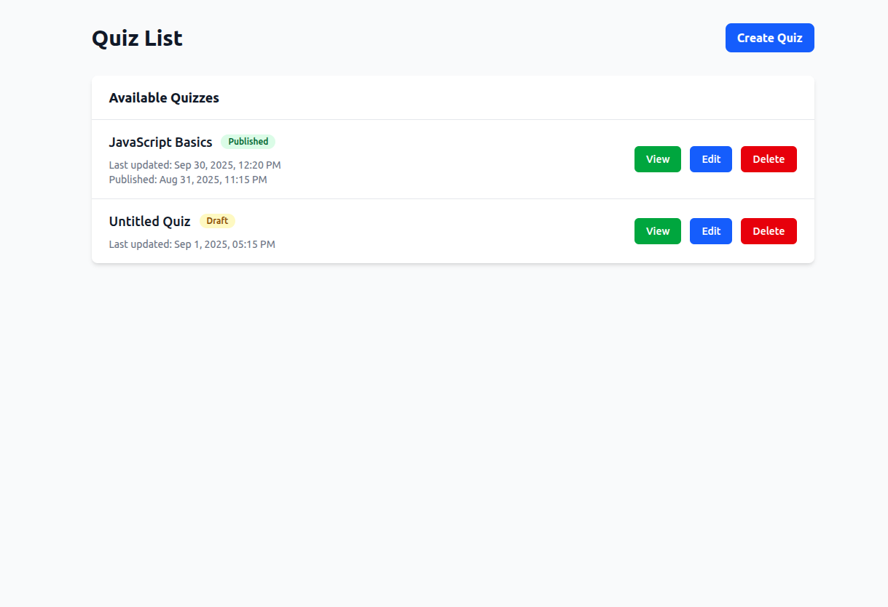
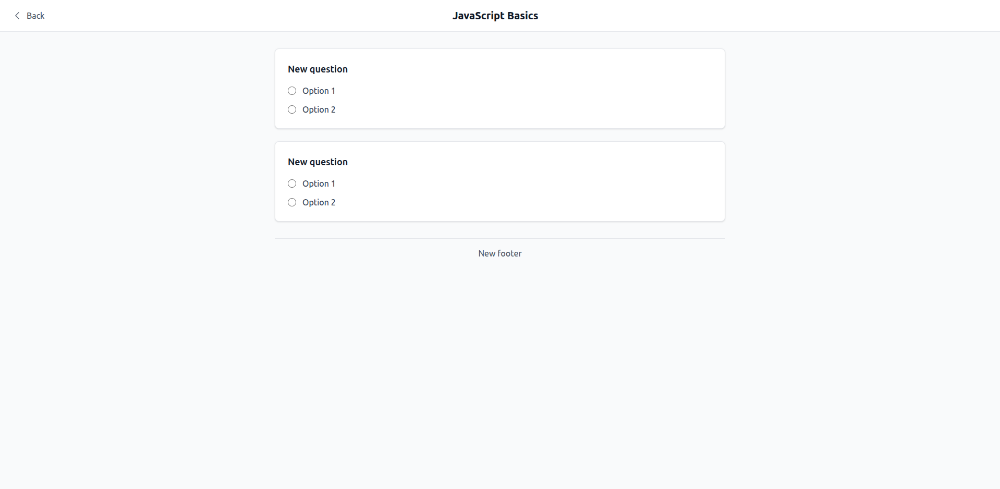
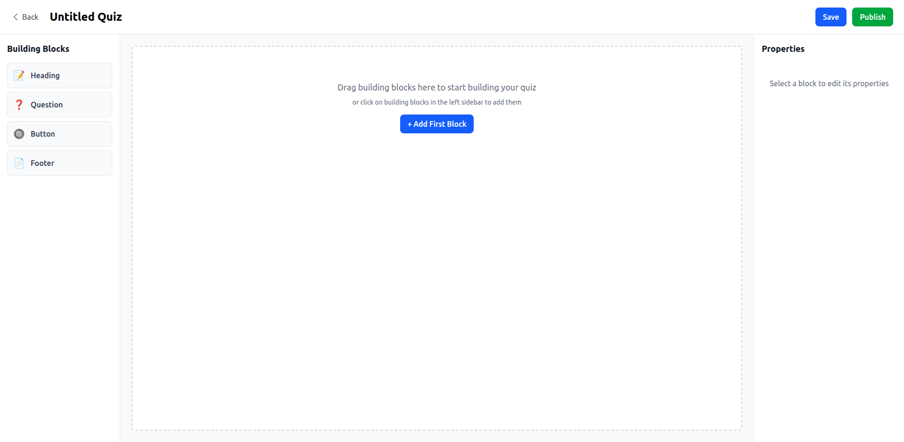
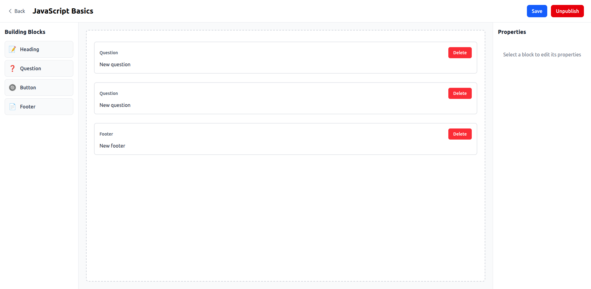

# Quiz App

A modern React-based quiz application that allows users to create, edit, and take quizzes with various question types and customizable layouts.

## Features

- 📝 Create and edit quizzes with a drag-and-drop interface
- 💫 Multiple question types support:
  - Single choice
  - Multiple choice
  - Text answers
- 🎨 Customizable UI elements:
  - Headers
  - Buttons
  - Footers
- 💾 Local storage persistence
- 📱 Responsive design
- 🎯 Real-time preview

## Tech Stack

- React
- TypeScript
- Vite
- React Router DOM
- TailwindCSS
- clsx (for conditional styling)

## Screenshots

### Quiz Editor



### Quiz Taking Interface



### Quiz Create



### Quiz Edit



## Getting Started

1. Clone the repository

```bash
git clone <repository-url>
```

2. Install dependencies

```bash
cd quiz_app
npm install
```

3. Run the development server

```bash
npm run dev
```

## Key Components

### QuizEditor

- Drag-and-drop interface for quiz creation
- Real-time preview
- Properties panel for block customization
- Building blocks sidebar

### QuizView

- Interactive quiz-taking interface
- Support for different question types
- Progress tracking
- Responsive design

### Quiz Storage

- Local storage-based persistence
- CRUD operations for quizzes

## Available Scripts

- `npm run dev` - Start development server
- `npm run build` - Build for production
- `npm run preview` - Preview production build
- `npm run lint` - Run ESLint
- `npm run type-check` - Run TypeScript type checking

## Contributing

1. Fork the repository
2. Create your feature branch (`git checkout -b feature/AmazingFeature`)
3. Commit your changes (`git commit -m 'Add some AmazingFeature'`)
4. Push to the branch (`git push origin feature/AmazingFeature`)
5. Open a Pull Request

## License

This project is licensed under the MIT License - see the LICENSE file for details
